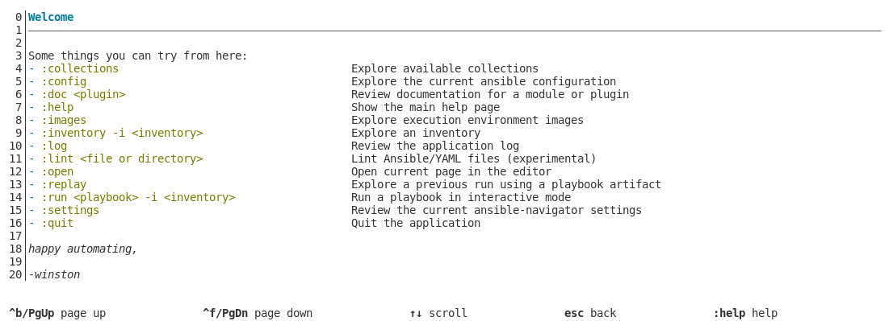

# Ansible dev space

When it comes to creating Ansible content, it's important to have a reliable
workspace. Workspaces always require some configuration and setup in order to
work with Ansible commands, content etc. Additionally, they should contain tools
to use while developing and troubleshooting. Think of RPM packages, python
dependencies etc. Requirements like these can conflict with the Operating System
(OS) default configuration. This results in tainting the underlying machine and
making it to become a dependency of the project itself. It get's even worse when
it comes to shipping and reliably reproducing these environments on other
machines or workspaces. To add on top of that, it becomes unmanageable when
working with multiple projects that each have different versions and
dependencies that will conflict with each other on the underlying workspace
host.

Containerized workloads provide many advantages such as consistency and built-in
dependencies. It's a widely adopted technology for delivering scalable services.
Many of these advantages can serve well when it comes to creating a development
environment that contains all the requirements and dependencies required for
developing.

Although there are a multitude of alternatives for creating and using confined
workspaces, this project utilizes [podman.io](https://podman.io/) as the
underlying OCI daemonless container engine for developing, managing, and running
OCI Containers on your Linux System.

This repository contains an example project to create a containerized workspace
for creating Ansible content. This example setup can be customized to use for
other purposes than Ansible.

# Requirements

- A host machine capable of reliably running
  [podman.io](https://podman.io/getting-started/installation) without issues.
- Make sure to have [podman.io](https://podman.io/) installed on the host.

> This setup is tried and tested on Fedora 35 and RHEL 8. *Not tested on MacOS
> and Windows systems*.

# Usage

1. Clone this repo to your workspace project directory.
2. Add the changes required to the project.
3. Build a container image using `podman` and a `Containerfile`.
4. Deploy a podman container using the container image.
5. Execute an interactive shell to the running container.
6. Work on your project.
7. When done, exit out of the running container. Stop-, remove- or redeploy the
   container whenever needed.


### Step 1

* Create a directory for your specific Ansible project.

```shell
$ mkdir ~/special-ansible-project
```

* Clone this repo to your workspace project directory.

```shell
$ cd ~/special-ansible-project
$ git clone https://github.com/Caseraw/ansible-dev-space-example-project.git
```

### Step 2

Get familiar with the example structure and add your own customizations.
Everything can be customized once you get familiar with the setup.

```text
$ tree . -L 4 --dirsfirst
.
├── workspace/                                          [1]
│   ├── my-special-project-file-1
│   ├── my-special-project-file-2
│   └── my-special-project-file-3
├── workspace-env/                                      [2]
│   ├── containerfiles/                                 [3]
│   │   └── Containerfile
│   ├── containers/                                     [4]
│   └── files/                                          [5]
│       ├── ssh/
│       │   ├── config
│       │   ├── id_rsa
│       │   ├── id_rsa.pub
│       │   └── known_hosts
│       └── bashrc
├── workspace-env-docs/                                 [6]
│   └── images/
│       └── ansible-navigator-sample-screen.png
└── README.md                                           [7]
```

| Number | Description |
|--------|-------------|
| 1 | The actual workspace your project files will reside in. What you'll be working on, on your host machine with VScode or another IDE you work with. |
| 2 | The directory that contains files used for your container image and container. |
| 3 | The directory that contains the conatiner files, used to build container images. |
| 4 | The directory that can contain cache container images, mapped for use within the container. *More about this in the next steps*. |
| 5 | The directory that can contain files to customize a running container, mapped for use within the container. *More about this in the next steps*. |
| 6 | The directory that contains docs and additional docs resources. |
| 7 | This `README.md` file. |

### Step 3

Have a look at the [Containerfile](workspace-env/containerfiles/Containerfile).
The base image is derived from the original [podman
image](https://quay.io/podman/stable:latest). On top of that image, several RPM
packages as well as python packages are installed and set up for use with the
`podman` user. Apply your own changes as much as you'd like. *Keep in mind that
it's originally based on the podman image*.

* Build the container image using `podman`:

```shell
podman build -f workspace-env/containerfiles/Containerfile -t ansible-dev-space-example-image:lab01
```

* Check the podman image list:

```shell
$ podman images

REPOSITORY                                 TAG         IMAGE ID      CREATED         SIZE
localhost/ansible-dev-space-example-image  lab01       8b86cc7e99e8  36 seconds ago  946 MB
quay.io/podman/stable                      latest      808669753c20  22 hours ago    349 MB
```

> Make sure to build new images from time to time to ensure forward
> compatibility of your containerized workspace. Additionally push the image to
> a registry where it can be stored centrally and consumed by a the audience
> that need it.

### Step 4

Run a container with `podman` using the image:

```shell
podman run -d --rm \
--name podman-ansible-dev-space-example \
--security-opt label=disable \
--security-opt unmask=ALL \
--userns=keep-id \
--user podman \
--device /dev/fuse \
-v ./workspace-env/containers:/home/podman/.local/share/containers:Z \
-v ./workspace-env/files/ssh:/home/podman/.ssh:Z \
-v ./workspace-env/files/bashrc:/home/podman/.bashrc:Z \
-v ./workspace:/home/podman/project:Z \
localhost/ansible-dev-space-example-image:lab01 \
sleep infinity
```

Check the running pods:

```shell
$ podman ps -a

CONTAINER ID  IMAGE                                            COMMAND         CREATED         STATUS             PORTS       NAMES
8e3779663c4e  localhost/ansible-dev-space-example-image:lab01  sleep infinity  13 seconds ago  Up 11 seconds ago              podman-ansible-dev-space-example
```

> Pay attention to the host-to-container directory mappings, these can be pretty
> handy! Also, note the `--rm` parameter. *More about this in the next steps*.

### Step 5

Execute an interactive shell to the running container:

```shell
$ podman exec -it podman-ansible-dev-space-example bash

Agent pid 93
Identity added: /home/podman/.ssh/id_rsa (podman@8e3779663c4e)

[podman@8e3779663c4e project]$
```

> Log in and out anytime you would like as long as the container is running.

### Step 6

Work on your awesome Ansible project! Do whatever you'd like inside the
container.

Use tools such as `ansible-navigator`. One of the amazing things here is that
`ansible-navigator` itself, uses `podman` to run Ansible execution environments.
So in reality this is an example of using containers inside of containers (as
I'd like to call, container-ception).

Another useful feature is the host-to-container mapping of the directory
`/workspace-env/containers:/home/podman/.local/share/containers:Z`. This
provides the possibility to cache container images used within the podman
container on the host for persistency. For example the `ansible-navigator` and
execution environment images don't always have to be pulled from the internet,
*except for the first time*.

Additional host-to-container mappings provide the capabilities to customize and
set up SSH and `.bashrc` configurations within the container. Your workspace
project files are also mapped to the container so they exist within the
container to work on. These features provide persistency without embedding it in
the container image itself. Reducing image size and possible data leaks such as
credentials and tokens.

```shell
$ podman exec -it podman-ansible-dev-space-example bash

Agent pid 118
Identity added: /home/podman/.ssh/id_rsa (podman@8e3779663c4e)

[podman@8e3779663c4e project]$ ansible-navigator 

--------------------------------------------------------------------
Execution environment image and pull policy overview
--------------------------------------------------------------------
Execution environment image name:     quay.io/ansible/creator-ee:v0.4.2
Execution environment image tag:      v0.4.2
Execution environment pull arguments: None
Execution environment pull policy:    tag
Execution environment pull needed:    True
--------------------------------------------------------------------
Updating the execution environment
--------------------------------------------------------------------
Running the command: podman pull quay.io/ansible/creator-ee:v0.4.2
Trying to pull quay.io/ansible/creator-ee:v0.4.2...
Getting image source signatures
Copying blob 9313088620cb done  
Copying blob 9f45cf1cd9f2 done  
Copying blob fee18ea417d6 done  
Copying blob f0a2109a2528 done
...
...
...
```



```shell
[podman@8e3779663c4e project]$ podman images

REPOSITORY                  TAG         IMAGE ID      CREATED       SIZE
quay.io/ansible/creator-ee  v0.4.2      12571ac947cf  3 months ago  2.4 GB
```

### Step 7

When done, exit out of the running container. Log in at a later time (if the
container is still running). Remove the container, redeploy the container. Do
whatever you'd like. As long as the files you value, are stored safely on host
using host-to-container mappings.

When running the `podman run` command with the additional parameters, you've
noticed the `--rm` flag. This ensures the removal of a stopped container. The
general philosophy behind this is that everything has to be reproducible. You
can customize whatever you'd like, as long as it's reproducible when redeploying
the the container.

> *Containers are cattle! Don't tread them as pets*.

# Advanced features

Yes there is more!

## Rootless, rootfull and privileged containers

The general principle is not to run privileged containers. Although there are
times when it's pretty handy to be able to run a privileged container. Think of
certain devices or resources only available on the host itself. Let's be honest,
this setup is a development environment and not a production setup to be
consumed nor exposed to the public. *Also to repeat, do not use this setup for
production use-cases to be consumed or exposed to the public or as a setup to
provide a containerized service*.

If needed, run the following command to run a privileged container. An
alternative to what is shown in [step 4](#step-4):

```shell
podman run -d --rm \
--name podman-ansible-dev-space-example \
--privileged \
--userns=keep-id \
--user podman \
-v ./workspace-env/containers:/home/podman/.local/share/containers:Z \
-v ./workspace-env/files/ssh:/home/podman/.ssh:Z \
-v ./workspace-env/files/bashrc:/home/podman/.bashrc:Z \
-v ./workspace:/home/podman/project:Z \
localhost/ansible-dev-space-example-image:lab01 \
sleep infinity
```

# Resources

- https://access.redhat.com/solutions/6161832